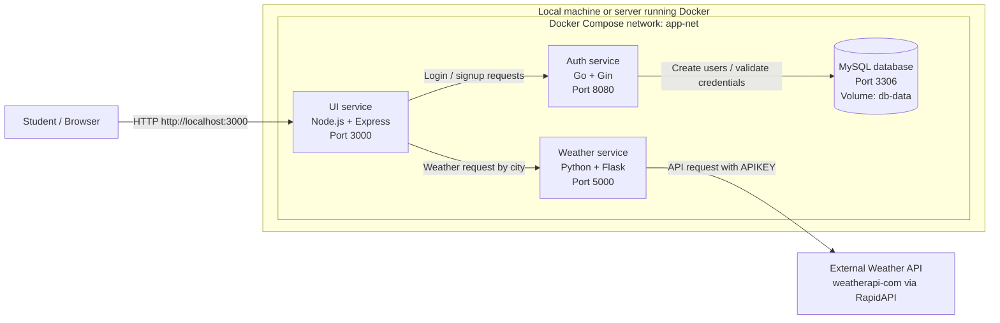

# Carles Weather App

Carles Weather App is a small microservices project used for DevOps practice. Students must deploy it with Docker Compose, test that every service works, and document every step they perform.

## Project architecture



## Services

| Service | Technology | Role | Internal port | Exposed to host |
|---|---|---|---:|---:|
| ui | Node.js / Express | Web interface, login, signup, weather search | 3000 | 3000 |
| auth | Go / Gin | User registration, login, JWT generation | 8080 | Not exposed |
| weather | Python / Flask | Gets weather data from RapidAPI Weather API | 5000 | Not exposed |
| db | MySQL | Stores users for the auth service | 3306 | Not exposed |

## Prerequisites

Before starting, install and verify:

- Git
- Docker
- Docker Compose plugin
- A RapidAPI key for the WeatherAPI service

Check your tools:

```bash
git --version
docker --version
docker compose version
```

## Important files

```text
.
├── UI/                 # Node.js frontend service
├── auth/               # Go authentication service
├── weather/            # Python weather API service
├── dc                  # Docker Compose file used in this repository
└── README.md           # Project instructions
```

Note: in this repository the Compose file is named `dc`. If your instructor asks you to use the default Compose name, copy it to `docker-compose.yml`:

```bash
cp dc docker-compose.yml
```

Then you can use `docker compose up` without `-f dc`.

## Deployment instructions with Docker Compose

### 1. Clone the repository

```bash
git clone <repository-url>
cd carles-weatherapp
```

If the repository is already cloned:

```bash
cd carles-weatherapp
git pull
```

### 2. Review the Compose file

Open the Compose file and identify all services:

```bash
cat dc
```

Students must document:

- the name of each service;
- the image or Dockerfile used by each service;
- the ports;
- the environment variables;
- the network;
- the volume used by MySQL.

### 3. Configure secrets and environment variables

The weather service needs an API key:

```yaml
weather:
  environment:
    APIKEY: <your-rapidapi-key>
```

For real projects, do not hardcode secrets in the Compose file. Prefer a `.env` file or CI/CD secrets.

Example `.env` file:

```env
APIKEY=replace-with-your-rapidapi-key
MYSQL_ROOT_PASSWORD=my-secret-pw
```

If you update the Compose file to use `.env`, reference variables like this:

```yaml
environment:
  APIKEY: ${APIKEY}
```

### 4. Build the containers

Because the Compose file is named `dc`, run:

```bash
docker compose -f dc build
```

If you renamed/copied it to `docker-compose.yml`, run:

```bash
docker compose build
```

### 5. Start the application

Using the current file name:

```bash
docker compose -f dc up -d
```

Or with `docker-compose.yml`:

```bash
docker compose up -d
```

### 6. Check running containers

```bash
docker compose -f dc ps
```

Expected result: the `ui`, `auth`, `weather`, and `db` services should be running.

### 7. Check logs

```bash
docker compose -f dc logs -f
```

To check one service only:

```bash
docker compose -f dc logs -f ui
docker compose -f dc logs -f auth
docker compose -f dc logs -f weather
docker compose -f dc logs -f db
```

### 8. Test the application in a browser

Open:

```text
http://localhost:3000
```

Expected workflow:

1. Open the web app.
2. Create a user using the signup page.
3. Log in with that user.
4. Search weather by city.
5. Confirm that the UI returns weather data.

### 9. Test services from the terminal

UI health check:

```bash
curl -i http://localhost:3000/health
```

Auth service from inside the Docker network:

```bash
docker compose -f dc exec ui sh -c "wget -qO- http://auth:8080/ || true"
```

Weather service from inside the Docker network:

```bash
docker compose -f dc exec ui sh -c "wget -qO- http://weather:5000/Douala || true"
```

### 10. Stop the application

```bash
docker compose -f dc down
```

To remove containers and the MySQL data volume:

```bash
docker compose -f dc down -v
```

Warning: `down -v` deletes the database volume. Use it only when you want to reset all local data.

## What students must document

Each student must create a deployment report. The report can be named:

```text
DEPLOYMENT-STEPS.md
```

The report must include:

1. Student name and date.
2. Operating system used.
3. Docker and Docker Compose versions.
4. Repository clone command.
5. Any changes made to environment variables.
6. Build command used.
7. Start command used.
8. Output of `docker compose ps`.
9. Screenshots or copied output showing the app running.
10. Problems faced and how they were solved.
11. Final test results.
12. Cleanup command used.

Example structure:

````markdown
# Deployment report

## Student information
- Name:
- Date:
- OS:

## Tool versions
```bash
docker --version
docker compose version
```

## Steps performed
1. Cloned the repository.
2. Reviewed the Compose file.
3. Configured API key.
4. Built the images.
5. Started the services.
6. Tested the UI.
7. Checked logs.

## Evidence
Paste command outputs and screenshots here.

## Issues and fixes
Explain errors and solutions.

## Final result
State whether the deployment worked.
````

## Troubleshooting

### Port 3000 is already in use

Change the host port in `dc`:

```yaml
ports:
  - "3001:3000"
```

Then open:

```text
http://localhost:3001
```

### The UI cannot reach auth or weather

Check that the Compose environment variables match the service names:

```yaml
AUTH_HOST: auth
AUTH_PORT: 8080
WEATHER_HOST: weather
WEATHER_PORT: 5000
```

Then restart:

```bash
docker compose -f dc down
docker compose -f dc up -d --build
```

### Weather search does not work

Check the API key:

```bash
docker compose -f dc logs weather
```

Make sure `APIKEY` is valid and has access to the RapidAPI Weather API.

### Auth service cannot connect to MySQL

Check the database logs:

```bash
docker compose -f dc logs db
docker compose -f dc logs auth
```

Make sure these values match:

```yaml
DB_HOST: db
DB_PASSWORD: my-secret-pw
MYSQL_ROOT_PASSWORD: my-secret-pw
```

## Learning objectives

By completing this deployment, students should understand:

- how Dockerfiles build service images;
- how Docker Compose connects multiple services;
- how environment variables configure containers;
- how internal service DNS works in a Compose network;
- how a frontend calls backend services;
- how a backend service connects to a database;
- how to read logs and troubleshoot containerized applications;
- why documenting deployment steps is important in DevOps.
