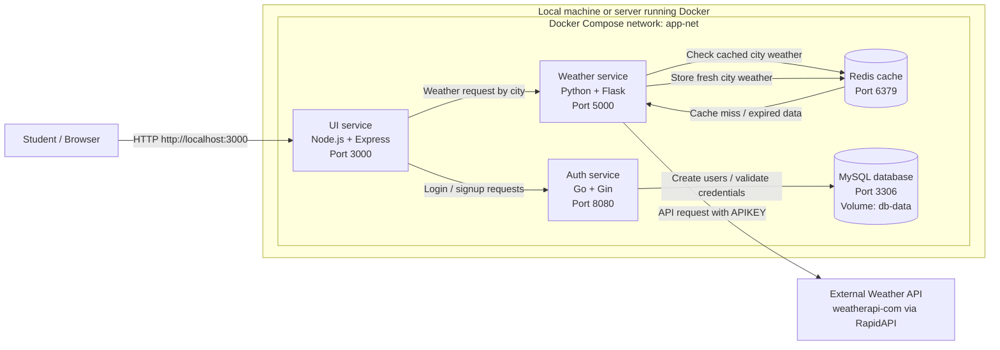

# Carles Weather App

Carles Weather App is a small microservices project used for DevOps practice. Students must deploy it with Docker Compose, test that every service works, and document every step they perform.

## Project architecture



Redis is shown in the flow as the caching layer students should consider for the weather feature. CI/CD tooling such as GitLab is not part of the required runtime flow; students can document or extend CI/CD choices at their own discretion.

## Services

| Service | Technology | Role | Internal port | Exposed to host |
|---|---|---|---:|---:|
| ui | Node.js / Express | Web interface, login, signup, weather search | 3000 | 3000 |
| auth | Go / Gin | User registration, login, JWT generation | 8080 | Not exposed |
| weather | Python / Flask | Gets weather data from RapidAPI Weather API | 5000 | Not exposed |
| redis | Redis | Cache layer for weather results or temporary data | 6379 | Not exposed |
| db | MySQL | Stores users for the auth service | 3306 | Not exposed |

## Prerequisites

Before starting, install and verify:

- Git
- Docker
- Docker Compose plugin
- A RapidAPI key for the WeatherAPI service

Check your tools:

```bash
git --version
docker --version
docker compose version
```

## Important files

```text
.
├── UI/                 # Node.js frontend service
├── auth/               # Go authentication service
├── weather/            # Python weather API service
└── README.md           # Project instructions
```

## Deployment instructions with Docker Compose

### 1. Clone the repository

```bash
git clone <repository-url>
cd carles-weatherapp
```

If the repository is already cloned:

```bash
cd carles-weatherapp
git pull
```

### 2. Create the Compose file from scratch

There is no ready-made Compose file in this repository. Students must create their own `docker-compose.yml` from scratch at the project root.

The file must define the following services:

- `ui`, built from `./UI`;
- `auth`, built from `./auth`;
- `weather`, built from `./weather`;
- `db`, using a MySQL image;
- `redis`, using a Redis image, when implementing the cache layer shown in the architecture.

Students must document:

- the name of each service;
- the image or Dockerfile used by each service;
- the ports;
- the environment variables;
- the network;
- the volumes used by MySQL and Redis if configured.

### 3. Configure secrets and environment variables

The weather service needs an API key:

```yaml
weather:
  environment:
    APIKEY: <your-rapidapi-key>
```

For real projects, do not hardcode secrets in the Compose file. Prefer a `.env` file or CI/CD secrets.

Example `.env` file:

```env
APIKEY=replace-with-your-rapidapi-key
MYSQL_ROOT_PASSWORD=my-secret-pw
```

If you update the Compose file to use `.env`, reference variables like this:

```yaml
environment:
  APIKEY: ${APIKEY}
```

### 4. Build the containers

After creating `docker-compose.yml`, build the application images:

```bash
docker compose build
```

### 5. Start the application

Run the stack with Docker Compose:

```bash
docker compose up -d
```

### 6. Check running containers

```bash
docker compose ps
```

Expected result: the `ui`, `auth`, `weather`, `redis`, and `db` services should be running if Redis is included in the Compose file.

### 7. Check logs

```bash
docker compose logs -f
```

To check one service only:

```bash
docker compose logs -f ui
docker compose logs -f auth
docker compose logs -f weather
docker compose logs -f redis
docker compose logs -f db
```

### 8. Test the application in a browser

Open:

```text
http://localhost:3000
```

Expected workflow:

1. Open the web app.
2. Create a user using the signup page.
3. Log in with that user.
4. Search weather by city.
5. Confirm that the UI returns weather data.

### 9. Test services from the terminal

UI health check:

```bash
curl -i http://localhost:3000/health
```

Auth service from inside the Docker network:

```bash
docker compose exec ui sh -c "wget -qO- http://auth:8080/ || true"
```

Weather service from inside the Docker network:

```bash
docker compose exec ui sh -c "wget -qO- http://weather:5000/Douala || true"
```

### 10. Stop the application

```bash
docker compose down
```

To remove containers and the MySQL data volume:

```bash
docker compose down -v
```

Warning: `down -v` deletes the database volume. Use it only when you want to reset all local data.

## What students must document

Each student must create a deployment report. The report can be named:

```text
DEPLOYMENT-STEPS.md
```

The report must include:

1. Student name and date.
2. Operating system used.
3. Docker and Docker Compose versions.
4. Repository clone command.
5. The complete `docker-compose.yml` they wrote.
6. Any changes made to environment variables.
7. Build command used.
8. Start command used.
9. Output of `docker compose ps`.
10. Screenshots or copied output showing the app running.
11. Problems faced and how they were solved.
12. Final test results.
13. Cleanup command used.

Example structure:

````markdown
# Deployment report

## Student information
- Name:
- Date:
- OS:

## Tool versions
```bash
docker --version
docker compose version
```

## Steps performed
1. Cloned the repository.
2. Created and reviewed `docker-compose.yml`.
3. Configured API key.
4. Documented the Compose services, networks, ports and volumes.
5. Built the images.
6. Started the services.
7. Tested the UI.
8. Checked logs.

## Evidence
Paste command outputs and screenshots here.

## Issues and fixes
Explain errors and solutions.

## Final result
State whether the deployment worked.
````

## Troubleshooting

### Port 3000 is already in use

Change the host port in `docker-compose.yml`:

```yaml
ports:
  - "3001:3000"
```

Then open:

```text
http://localhost:3001
```

### The UI cannot reach auth or weather

Check that the Compose environment variables match the service names:

```yaml
AUTH_HOST: auth
AUTH_PORT: 8080
WEATHER_HOST: weather
WEATHER_PORT: 5000
```

Then restart:

```bash
docker compose down
docker compose up -d --build
```

### Weather search does not work

Check the API key:

```bash
docker compose logs weather
```

Make sure `APIKEY` is valid and has access to the RapidAPI Weather API.

### Auth service cannot connect to MySQL

Check the database logs:

```bash
docker compose logs db
docker compose logs auth
```

Make sure these values match:

```yaml
DB_HOST: db
DB_PASSWORD: my-secret-pw
MYSQL_ROOT_PASSWORD: my-secret-pw
```

## Learning objectives

By completing this deployment, students should understand:

- how Dockerfiles build service images;
- how Docker Compose connects multiple services;
- how environment variables configure containers;
- how internal service DNS works in a Compose network;
- how a frontend calls backend services;
- how a backend service connects to a database;
- how to read logs and troubleshoot containerized applications;
- why documenting deployment steps is important in DevOps.
